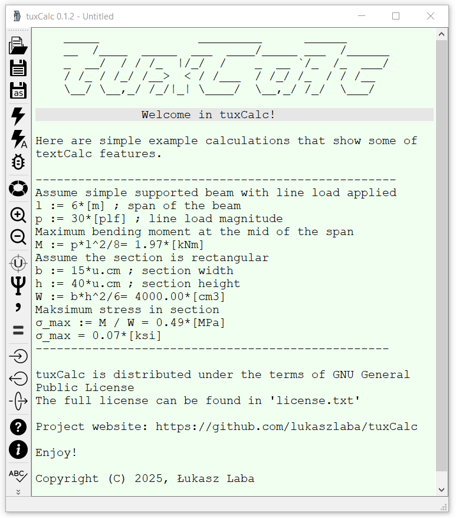

tuxCalc - simple plain text calculator
---------------------------------------

`Download for Windows <https://github.com/lukaszlaba/tuxCalc/releases>`_

Changelog
---------

tuxCalc 0.0.3 wip (beta stage)
  - name changed
  - beta version

tuxCalc 0.0.2 (beta stage)
  - new fratures added
  - beta version

textCalc 0.0.1 (POC stage)
  - POC version

Description
-----------

In daily engineer's work you sometimes need create simply or a bit more advanced calculations
and embed them in to master report (which is Word, PDF or other format file). testCalc allow to
create plain text including mathematical expressions. Math expressions are automatically updated.
You can force expressions update manually or switch into dynamic update as you write the text.
So all you need to have your simple dynamic calculation content is just plain text so you can
copy-paste it where you need after all. Please note that this app is at early stage.

AI free, human brain made software. 😆

Requirements
------------
tuxCalc is based on Python 3 and few non-standard Python library:

  - PyQt5 (https://www.riverbankcomputing.com/software/pyqt) - user interface
  - Unum (https://pypi.python.org/pypi/Unum) - it is what make unit calculation possible (future feature)

How to run it
-------------

After Python and needed library installed, just run tuxCalc.py file.

There is also windows binaries available. Just download it and run exe file.
Please find link to windows binaries download below.

https://github.com/lukaszlaba/tuxCalc/releases

License
-------

Copyright (C) 2025 Łukasz Laba <lukaszlaba@gmail.pl>

tuxCalc is free software; you can redistribute it and/or modify
it under the terms of the GNU General Public License as published by
the Free Software Foundation; either version 2 of the License, or
(at your option) any later version.

tuxCalc is distributed in the hope that it will be useful,
but WITHOUT ANY WARRANTY; without even the implied warranty of
MERCHANTABILITY or FITNESS FOR A PARTICULAR PURPOSE.  See the
GNU General Public License for more details.

You should have received a copy of the GNU General Public License
along with tuxCalc; if not, write to the Free Software
Foundation, Inc., 51 Franklin St, Fifth Floor, Boston, MA  02110-1301  USA

Contributions
-------------

If you want to help out, create a pull request. You can also contact by email.

More information
----------------

Project website: https://github.com/lukaszlaba/kipsiCalc

Code repository: https://github.com/lukaszlaba/tuxCalc

Windows binaries download: https://github.com/lukaszlaba/tuxCalc/releases

Contact: Łukasz Laba <lukaszlaba@gmail.pl>
